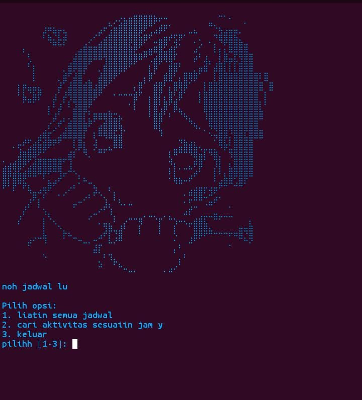

# 🗓️ Jadwal buat Kakak Pemalas  

  

---

program ini cumaa buat ngejalanin jadwal ala2 kakak pemalasss 😴 pake **php cli** gituu, fiturnya ga ribet sihh:  
- 📖 liat semua jadwal  
- ⏰ cari aktivitas sesuai jam yg lu masukin  
- 🚪 keluar kalo udah bosen  

## 📸 Preview hasil run  

  
  <b>📌 Tampilan Menu Awal</b>    
    

  

  
  <b>⏰ Contoh Input Jam</b>    
    

---

  

  
  
  

# 🚀 Cara run PHP di Termux dan linux

## 📱 Termux (Android)

 1. Update & Upgrade

pkg update && pkg upgrade -y

 2. Install PHP

pkg install php -y

 3. Cek versi PHP

php -v

 4. Jalankan file PHP

php index.php

 5. Jalankan PHP server (opsional)

php -S localhost:8080

---
## 💻 Linux (PC/laptop)

 1. Update sistem

sudo apt update && sudo apt upgrade -y

 2. Install PHP

sudo apt install php -y

 3. Cek versi PHP

php -v

 4. Jalankan file PHP

php index.php

 5. Jalankan PHP server (opsional)

php -S localhost:8000